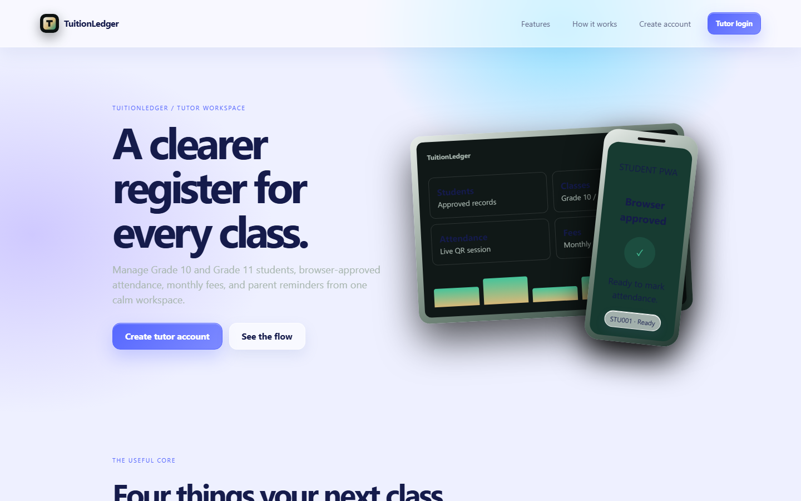
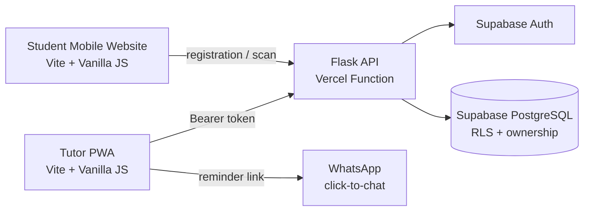
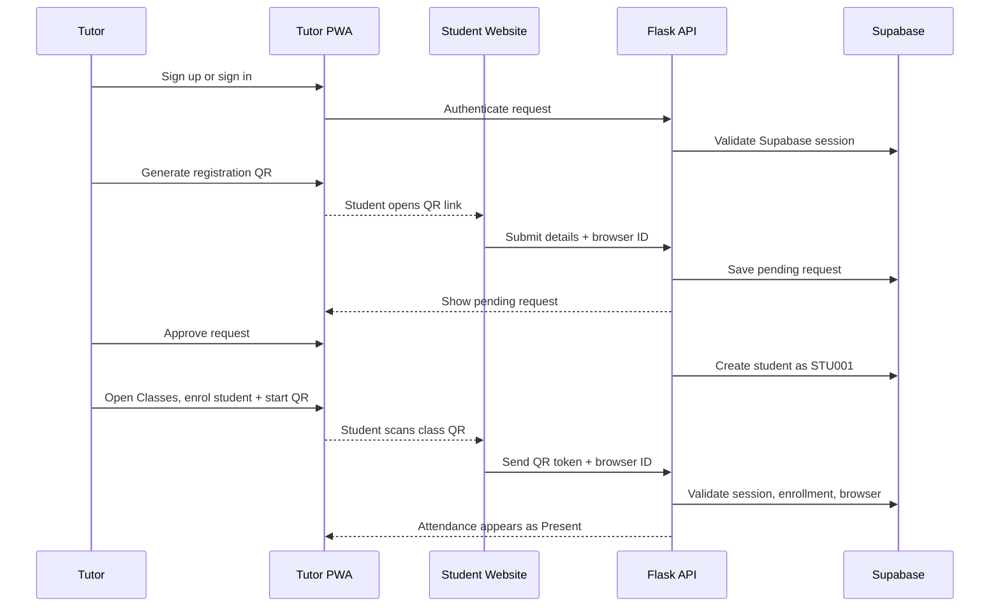
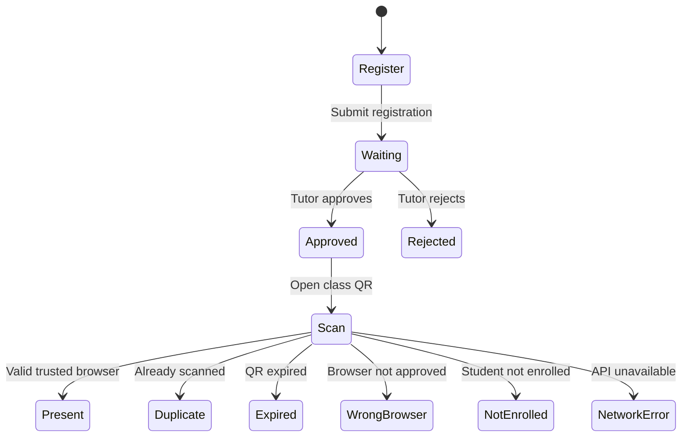
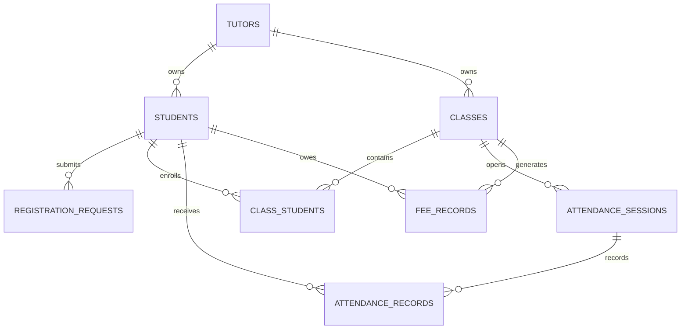

# TuitionLedger

<div align="center">

## A calmer way to run tuition classes

**Tutor operations, browser-trusted student attendance, and monthly fees in one focused workspace.**

<p>
  
  
  
  
</p>

[Tutor PWA](https://tuitionledger-frontend.vercel.app) · [Student Mobile Website](https://tuitionledger-mobile.vercel.app) · [API health](https://tuitionledger-backend.vercel.app/health)

</div>



<div align="center"><sub>The Frosted Touch landing experience: one calm workspace for tutors and one trusted browser flow for students.</sub></div>

---

## Product overview

TuitionLedger is a full-stack HNDIT group-project MVP for tutors who need a simple, reliable way to manage students, classes, attendance, and fees. Tutors use an installable PWA with five focused workspaces. Students use a deliberately small responsive website: no installation, password, dashboard, or unnecessary controls.

The product is built around one trust boundary: a tutor approves a student's browser once, and that browser is then used to scan attendance QR codes.

### Core promise

> **Register once. Approve clearly. Scan quickly. Keep the ledger accurate.**

## What is included

| Area | Capability |
| --- | --- |
| Tutor authentication | Supabase email sign-up, confirmation, login, session persistence, sign-out |
| Student directory | Add, edit, archive, browser reset, search-ready records, sequential IDs (`STU001`) |
| Registration | Tutor-generated QR, mobile registration form, pending approval, approve/reject |
| Classes | Class CRUD, schedules, monthly fees, enrollment, short-lived attendance QR, countdown and session ending |
| Attendance | Date/class history, present/absent status and manual correction |
| Fees | Monthly fee generation, paid/unpaid status, WhatsApp click-to-chat reminder |
| Tutor PWA | Manifest, service worker, install support and a read-only offline fallback |
| Student Mobile Website | Persistent browser ID, registration/waiting/approved states and attendance result states |
| Design system | Frosted Touch surfaces, rounded cards, soft gradients, bento dashboard, matte-glass icons |

## System at a glance



## End-to-end workflow



## Repository map

```text
TuitionLedger/
├── tutor-frontend/          # Installable Tutor PWA (Vite + Vanilla JS)
│   ├── src/main.js          # Hash routes and page workflows
│   ├── src/style.css        # Base layout and Frosted Touch styles
│   ├── src/theme-overrides.css
│   └── public/               # Manifest, service worker, icons and offline page
├── student-mobile/          # Responsive Student Mobile Website
│   ├── src/main.js          # Registration and attendance states
│   ├── src/style.css        # Mobile-first UI
│   └── public/               # Website logo only; no PWA assets
├── backend/                 # Flask API and Vercel Python entrypoint
│   ├── app.py               # Routes, auth validation and error handling
│   ├── api/index.py         # Vercel adapter
│   └── requirements.txt
├── supabase/schema.sql      # Tables, constraints, indexes and RLS policies
├── .gitignore
└── README.md
```

## Tutor PWA pages

| Route | Purpose |
| --- | --- |
| `#top` | Landing page, product explanation and tutor actions |
| `#login` | Tutor sign-in with modern password visibility control |
| `#signup` | Tutor account creation and email-confirmation guidance |
| `#dashboard` | Overview: totals, today's classes and recent activity |
| `#students` | Student CRUD, registration QR, approvals, browser reset and read-only enrolled classes |
| `#classes` | Class CRUD, enrollment, attendance QR, duration, countdown and session ending |
| `#attendance` | Date/class attendance history and manual present/absent correction |
| `#fees` | Monthly ledger, paid/unpaid updates and WhatsApp reminders |

## Student Mobile Website states



## Data model



Every tutor-managed table carries ownership data. Row Level Security and server-side tutor checks prevent one tutor from reading or changing another tutor's records.

## API surface

All responses use one predictable envelope:

```json
{ "success": true, "data": {} }
```

Errors use the same shape:

```json
{ "success": false, "message": "Readable error message" }
```

### Authentication and profile

```text
POST  /api/auth/signup
POST  /api/auth/login
POST  /api/auth/refresh
GET   /api/tutor
PUT   /api/tutor
```

### Students and registration

```text
GET    /api/students
POST   /api/students
PUT    /api/students/:id
DELETE /api/students/:id
POST   /api/students/:id/reset-browser
POST   /api/registration-qr
POST   /api/register-student
GET    /api/registration-requests/:id/status
GET    /api/registration-requests
POST   /api/registration-requests/:id/approve
POST   /api/registration-requests/:id/reject
POST   /api/browser-requests
GET    /api/browser-requests/:id/status
GET    /api/browser-requests
POST   /api/browser-requests/:id/approve
POST   /api/browser-requests/:id/reject
```

### Classes, attendance and fees

```text
GET    /api/classes
POST   /api/classes
PUT    /api/classes/:id
DELETE /api/classes/:id
GET    /api/classes/:id/students
POST   /api/classes/:id/students
DELETE /api/classes/:id/students/:student_id
POST   /api/attendance-sessions
POST   /api/attendance-sessions/:id/end
GET    /api/attendance/classes/:class_id
POST   /api/attendance/scan
POST   /api/attendance/manual
GET    /api/fees
POST   /api/fees/generate
PUT    /api/fees/:id
GET    /api/fees/:id/whatsapp
```

## Local setup

### Requirements

- Node.js 18 or newer
- Python 3.11 or newer
- A Supabase project with Auth and PostgreSQL enabled
- PowerShell, Bash, or an equivalent terminal

### 1. Configure Supabase

Copy the example environment file:

```powershell
Copy-Item backend/.env.example backend/.env
```

Set values in `backend/.env`:

```env
SUPABASE_URL=https://your-project-ref.supabase.co
SUPABASE_PUBLISHABLE_KEY=your_publishable_key
DATABASE_URL=your_session_pooler_connection_string
ALLOWED_ORIGINS=http://localhost:5173,http://localhost:5174
AUTH_REDIRECT_URL=http://localhost:5173/#login
```

Use the **Session pooler** connection string from Supabase Dashboard → Connect → Connection Pooling. URL-encode special characters in the database password. Never commit `.env`, service-role keys, or database passwords.

Do **not** run the destructive reference `supabase/schema.sql` against an existing database. Back up and inspect the live schema, then apply the reviewed incremental migration:

```text
supabase/migrations/20260716102500_final_requirements_foundation.sql
```

See [migration verification](docs/DATABASE_MIGRATION_VERIFICATION.md) before changing production data.

### 2. Start the Flask API

```powershell
cd backend
python -m pip install -r requirements.txt
python -m flask --app app run --host 0.0.0.0 --port 8000
```

Check it at [http://localhost:8000/health](http://localhost:8000/health).

### 3. Start the Tutor PWA

```powershell
cd tutor-frontend
npm install
npm run dev -- --host 0.0.0.0 --port 5173
```

Open [http://localhost:5173](http://localhost:5173).

### 4. Start the Student Mobile Website

```powershell
cd student-mobile
npm install
npm run dev -- --host 0.0.0.0 --port 5174
```

Open [http://localhost:5174](http://localhost:5174) from a phone on the same network.

## Verification checklist

Run the fast checks before every deployment:

```powershell
cd tutor-frontend
npm run build

cd ..\student-mobile
npm run build

cd ..
python -m compileall -q backend
python -m pytest backend/tests -q
git diff --check
```

### Acceptance test

- [ ] Tutor sign-up displays a clear success or error state.
- [ ] Confirmation email returns to the current tutor login URL.
- [ ] Tutor can sign in and sign out.
- [ ] Tutor can create Grade 11 Maths and Grade 10 Science.
- [ ] Registration QR opens the Student Mobile Website.
- [ ] Student submission appears as pending.
- [ ] Approval creates `STU001` on a fresh database.
- [ ] Student enrollment is managed from Classes and shown read-only in Students.
- [ ] Attendance QR starts from Classes, counts down, ends, and accepts the approved browser.
- [ ] Attendance contains history and manual correction but no QR controls.
- [ ] Duplicate, expired, wrong-browser and not-enrolled states are friendly.
- [ ] Fee status changes from unpaid to paid.
- [ ] WhatsApp click-to-chat contains the correct student and amount.
- [ ] Tutor manifest, icons, service worker and install support load successfully.
- [ ] Student website has no manifest, service worker or install prompt.
- [ ] Tutor PWA and Student Mobile Website remain separate deployments.

## Production deployment

TuitionLedger runs as three Vercel projects backed by one Supabase project:

| Service | Vercel project | URL |
| --- | --- | --- |
| Tutor PWA | `tuitionledger-frontend` | [tuitionledger-frontend.vercel.app](https://tuitionledger-frontend.vercel.app) |
| Flask backend | `tuitionledger-backend` | [tuitionledger-backend.vercel.app](https://tuitionledger-backend.vercel.app) |
| Student Mobile Website | `student-mobile` | [tuitionledger-mobile.vercel.app](https://tuitionledger-mobile.vercel.app) |

Configure production variables:

```env
# Tutor and student Vercel projects
VITE_API_BASE_URL=https://tuitionledger-backend.vercel.app
VITE_STUDENT_APP_URL=https://tuitionledger-mobile.vercel.app

# Backend Vercel project
SUPABASE_URL=https://your-project-ref.supabase.co
SUPABASE_PUBLISHABLE_KEY=your_publishable_key
DATABASE_URL=your_session_pooler_connection_string
ALLOWED_ORIGINS=https://tuitionledger-frontend.vercel.app,https://tuitionledger-mobile.vercel.app
AUTH_REDIRECT_URL=https://tuitionledger-frontend.vercel.app/#login
```

Also add the tutor login URL to Supabase Authentication → URL Configuration:

```text
https://tuitionledger-frontend.vercel.app/#login
```

Deploy each project from its directory:

```powershell
vercel deploy --prod --yes --scope weirdos
```

## Design language

The interface uses **Frosted Touch**: translucent glass panels, diffused shadows, rounded geometry, a soft cyan/lavender atmosphere, navy text, matte-glass icons, and bento-style dashboard summaries. The visual system is intentionally expressive without hiding the simple Vanilla JavaScript implementation.

## Security boundaries

- Supabase Auth owns tutor identity and email confirmation.
- Flask validates bearer tokens before protected operations.
- Tutor ownership is enforced in API queries and PostgreSQL RLS policies.
- Student access is browser-trusted rather than password-based.
- Attendance QR tokens are short-lived and single-purpose.
- WhatsApp is only a generated click-to-chat URL; no automated messaging service is used.
- Technical database and Python errors are converted into readable UI messages.

## Known boundaries

- Students do not install an app and do not have a password login or tutor dashboard.
- The Tutor PWA caches only its shell; live database editing remains online-only.
- WhatsApp reminders require the tutor to click and send them.
- Attendance requires enrollment and an approved browser.
- Supabase must be reachable for database-backed workflows.
- This is an HNDIT group-project MVP, not a replacement for a full accounting platform.

## Project status

TuitionLedger is an actively developed full-stack MVP. Keep the schema, API response envelope, tutor ownership rules, and live acceptance workflow aligned when adding features.

## License

Educational project for the TuitionLedger HNDIT group.
